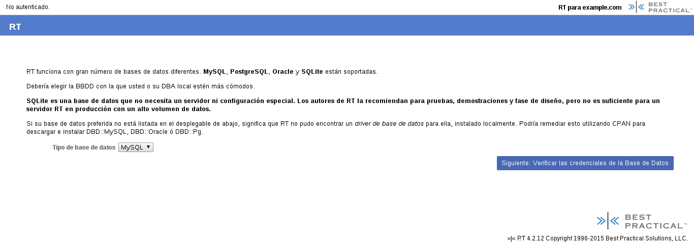
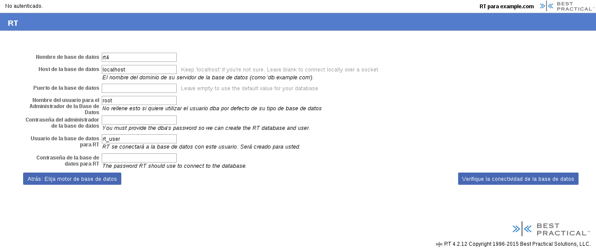
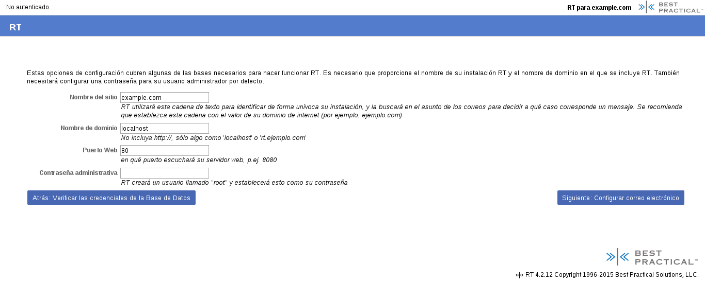
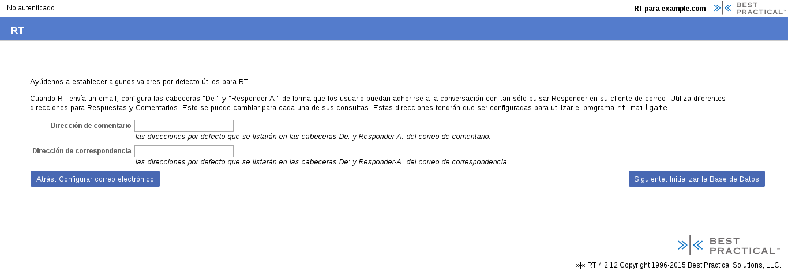
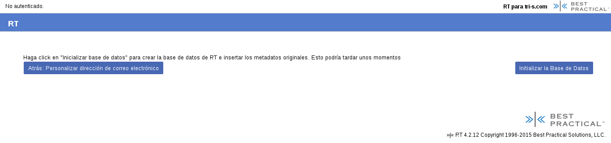
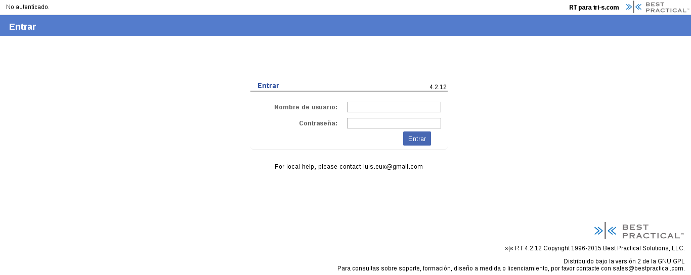
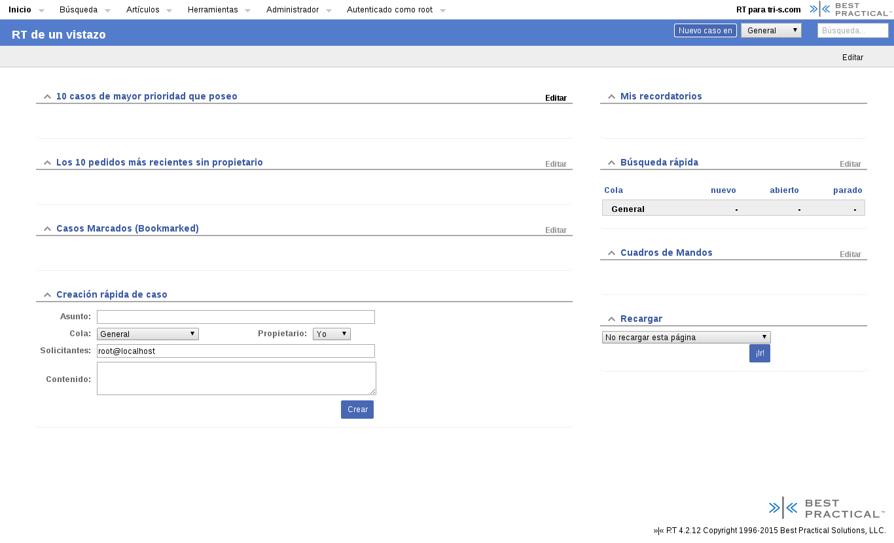

##Manual de Instalación de Request Tracker

1. Antes de instalar Request Tracker debe tener instalado los siguientes paquetes:
    * Compilador de C y make ```apt-get install build-essential```
    * Perl 5.10.1 o mayor (http://www.perl.org). Los sistemas debian ya lo traen, para verificar correr en terminal  ```$perl -v```
    
    * Una base de datos SQL aprobada:
        - MySQL 5.1+ con InnoDB support (https://www.mysql.com).
        - Postgres 8.4+, se recomienda la versión 9.0 (http://www.postgresql.org).
        - Oracle 9iR2+ (http://www.oracle.com/index.html).
        - SQLite 3.0+ (https://www.sqlite.org/).
        En este caso se instaló MySQL con el comando de terminal ```$sudo apt-get install mysql-server```

    * Apache 1.3.x o 2.x, en este caso se instaló con ```$sudo apt-get install apache2```

    * Instalar modperl 1 o modperl2 dependiendo de la versión instalada de apache. Fue instalado en esta guía con el comando ```$sudo apt-get install libapache2-mod-perl2```

2. Descargar rt-4.x (https://www.bestpractical.com/rt/download_file.html).

3. Extraer el archivo rt-4.x.tar.gz que se descargo donde se quiera instalar, esto se puede hacer con el comando: ```$tar xzvf rt.tar.gz -C /ruta/a/descomprimir```

4. Ir al directorio donde se descomprimió RT con el comando ```$cd /ruta/a/descomprimir```

5. Configurar RT con el comando ```$./configure --parametrosadicionales```. Para los parámetros adicionales se pueden ver con el comando ```$./configure --help```. En este caso se corrió con el parámetro de set web handler: ```$./configure --with-web-handler=modperl2```

6. Verificar que RT tiene todas las dependencias requeridas con el comando ```$make testdeps```, en caso de que no hayan errores puede seguir con el paso #9.

7. En caso de que hayan errores en el paso anterior, correr el comando ```$make fixdeps```. Si sale un error refiriéndose a la configuración del CPAN shell correr el comando ```$ /usr/bin/perl -MCPAN -e shell``` y volver a correr ```$make fixdeps```

8. Una vez finalizado el make fixdeps, se debe volver a correr el comando ```$make testdeps```, cuando no encuentra errores se despliega el siguiente mensaje: “All dependencies have been found.”.

9. Hacer la instalación de RT con el comando ```$sudo make install```

10. Para configurar RT se corre el comando ```$sudo /opt/rt4/sbin/rt-server --port [número del puerto]```, luego en el navegador se entra a http://0:numerodelpuerto/ y se siguien los siguientes pasos de configuración:

    + El primer paso es elegir el idioma en el cual se desea utilizar RT, para este caso se utilizará Español.

    

    + En la siguiente ventana se puede elegir la base de datos en la cual se trabajaran los datos de RT, como instalamos MySql, esta será la base de datos que utilizaremos para nuestra configuración de RT.

    

    + Después de elegir la base de datos se deben establecer  los siguientes parámetros:
        * El nombre que tendrá la base de datos.
        * El nombre del dominio de su servidor de la base de datos.
        * El puerto que utilizará la base de datos. 
        * El nombre de usuario para el DBA.
        * Contraseña para el usuario del DBA.
        * El nombre de usuario de la base de datos para RT.
        * Contraseña de la base de datos para RT.

    

    + Luego se verifica la conectividad con la base de datos.

    

    + En el siguiente paso se establecen las siguientes opciones de configuración:
        * Nombre del sitio que utiliza RT para identificar de forma única la instalación.
        * Nombre del dominio en el cual se incluirá RT.
        * El número del puerto que escuchará su servidor web. 
        * Contraseña administrativa para RT (RT crea un usuario administrativo por defecto con el nombre “root”.)

    

    + También se debe establecer la ruta donde se encontrará el ejecutable “sendmail” y el correo electrónico administrativo de RT. 

    

    + Hay valores por defecto que también se pueden establecer como los correos de comentario y de correspondencia. 

    

    + Luego se inicializa la base de datos. 

    

    + Al terminar de inicializar la base de datos se concluye la instalación de RT. 

    

    + Luego se muestra la página de inicio de RT donde se puede entrar con el usuario administrativo de RT (root).

    

    + Esta es la página principal de RT que se muestra cuando se logra iniciar sesión. 

    

11. Una vez configurado, cada vez que se quiere iniciar el servidor de RT se pone ```$sudo /opt/rt4/sbin/rt-server``` para correr el servidor de RT.
