## Manual Técnico para TRI-S 

Centro Académico de Alajuela - ITCR

Creado por:
    - Luis E. Ugalde
    - Diego Ugalde

___

#### Información general del sistema

TRI-S se divide en los siguientes cuatro componentes:

1. Aplicación móvil:

    Desarrollada con Phonegap utilizando únicamente HTML5, CSS3 y Javascript. A continuación se listan elementos importantes para el mantenimiento de la aplicación: 

    * Está aplicación se encuentra actualmente en la versión 1.0.0 y está disponible únicamente para Android. 

    * La aplicación se puede configurar editando el archivo ```config.xml```.

    * La página principal se encuentra en la carpeta ```www/index.html``` y esta se encarga de cargar todos los formularios HTML almacenados en ```www/forms``` con el Javascript ```www/js/form_loader.js```

    * La aplicación hace solicitudes HTTP al servicio web de Java, la ruta donde se envían puede ser cambiada en el archivo ```www/js/appSettings.js```.

    * En caso de modificar el código, se puede generar un nuevo .apk haciendo uso de la siguiente guía: http://docs.phonegap.com/references/phonegap-cli/ .

2. Aplicación web

    Constituida por los archivos HTML, CSS y Javascript que despliegan el Front-End en un navegador. Está aplicación será visualizada en la URL http://tec.siua.ac.cr/solicitudes . Los siguientes puntos son consideraciones a tomar en cuenta al darle mantenimiento a la aplicación:

    * En el ```index.html``` se cargan todos los formularios disponibles en ```forms/``` usando el Javascript ```js/loadForms.js```.

    * Para configurar las rutas a las que se hacen solicitudes con AJAX y la llave pública del ReCaptcha se debe editar el archivo ```js/appSettings.js```.

3. Servicio web

    Desarrollado en Java 8 con el framework Spring Boot 1.3.1. Se utilizó Gradle 2.3 para el manejo de paquetes y la construcción del sistema. La estructura del servicio web es la siguiente: 

    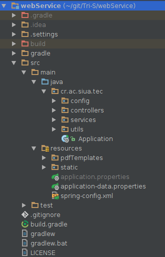

    En el archivo build.gradle se pueden añadir dependencias, tareas y cambiar la versión y el nombre del .jar. A continuación se listan consideraciones importantes para la utilización y el mantenimiento del servicio web:

    * Para compilar el proyecto se utiliza el comando ```$ ./gradlew build -x test```. 
     
    * Para ejecutarlo se utiliza el comando ```$ java -jar build/libs/TRI-S-webService-1.0.0.jar```.

    * Los datos de configuración se almacenan en el archivo ```src/main/resources/static/application.properties```, el cual tiene información del servidor, el ReCaptcha y Request Tracker. Los datos de RT son importantes porque indican el URL donde corre el servidor y las credenciales del usuario que se comunica con el REST API de RT. 

    * El servicio tiene dos controladores: 

        * ExportController: Recibe las solicitudes de exportar un documento a PDF de la instancia de RT. En caso de que el dominio de RT cambie, se debe cambiar el string que se le pasa al annotation: ```@CrossOrigin(origins = "nuevoDominio")```

        * FormController: Recibe las solicitudes para crear un tiquete de las aplicaciones web y móvil. El método ```createTicket()``` tiene la anotación ```@CrossOrigin```, la cual debe coincidir con el dominio en el que está corriendo la aplicación web. 

4. Request Tracker

    La versión instalada es la 4.2.12 y trabaja con el motor de base de datos MySQL. La instalación de RT se encuentra en la ruta ```/opt/rt4```. Para modificar el HTML, CSS y Javascript se pueden añadir archivos a la carpeta ```/opt/rt4/local```, para aplicar los cambios debe borrar el cache de la carpeta de mason de RT con el comando ```rm -rf /opt/rt4/var/mason_data/obj/*```. Para más información: http://requesttracker.wikia.com/wiki/CustomizingWithLocalDir .

    RT ya está configurado y listo para ser utilizado. Sin embargo, si se desea cambiar su configuración se debe modificar el archivo ```/opt/rt4/etc/RT_SiteConfig.pm```.

    Para iniciar RT manualmente se escribe en terminal ```$ /opt/rt4/sbin/rt-server --port xx```.

    La documentación compelta de RT se puede encontrar en https://bestpractical.com/docs/rt/4.2/ .

___

#### Administración de cuentas vinculadas a TRI-S

Se cuenta con un archivo de KeePassX (.kdbx), el cual contiene una base de datos divida en grupos (MySQL, RT, gmail). 

___

#### Creación de objetos de RT

Para las siguientes instrucciones se recomienda utilizar el usuario root de RT o alguno con los permisos requeridos.

1. Campo personalizado 

    Los campos personalizados se crean para después ser ligados a colas o artículos. Para crear campos personalizados se hace clic en la opción del Menú principal y se llena la información solicitada. Los campos de Validación, Vincular valores a e Incluir página son opcionales.

    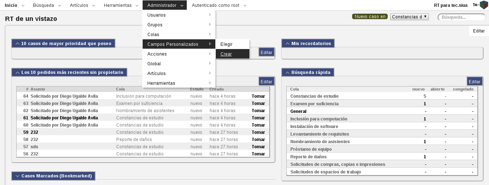

    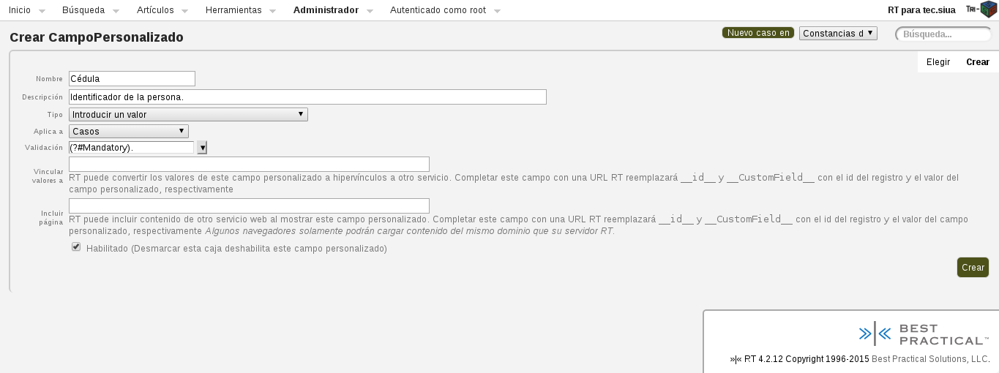 

2. Cola

    Para crear una cola se selecciona la opción en el menú principal y se procede a llenar los campos.

    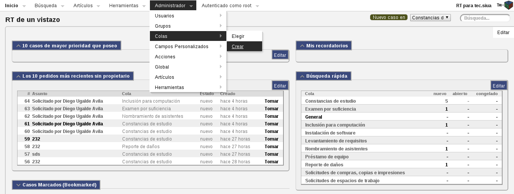

    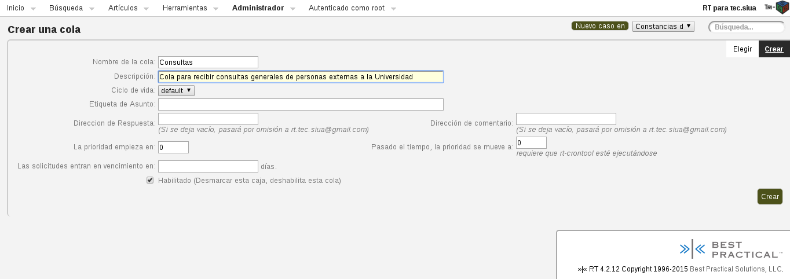 

    Una vez que se crea una cola, es posible añadirle campos personalizados. Para eso se siguen los siguientes pasos:

    + Selecciona la opción de 'Elegir cola'.

    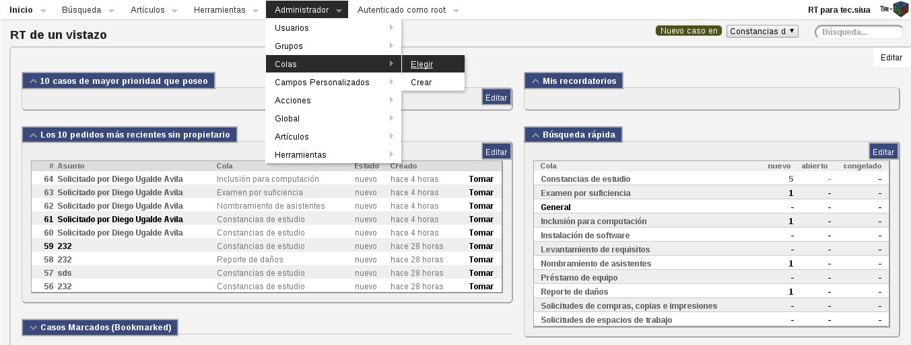 

    + Se elige la cola deseada.

     

    + Se hace clic en los campos personalizados para casos.

    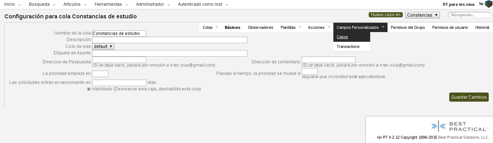 

    + Se marcan los campos que se quieren añadir.

    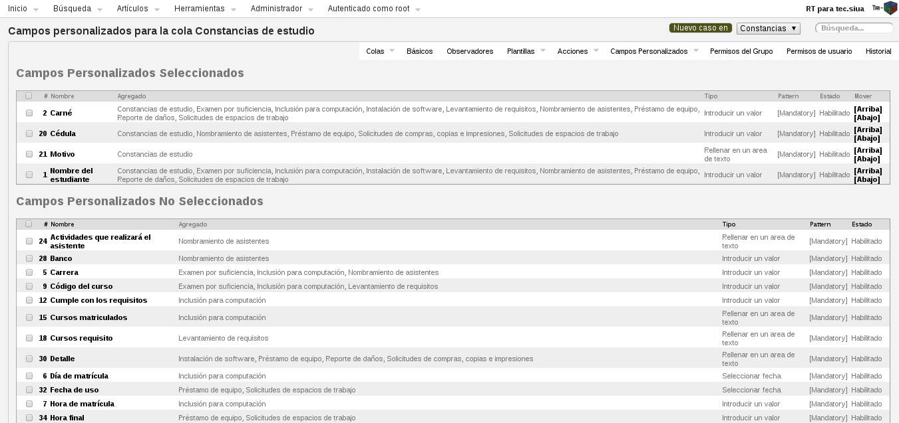 

3. Plantilla

    Para crear una plantilla se hace clic en el Menú principal -> Global -> Plantillas -> Crear y se llena el formulario. 

    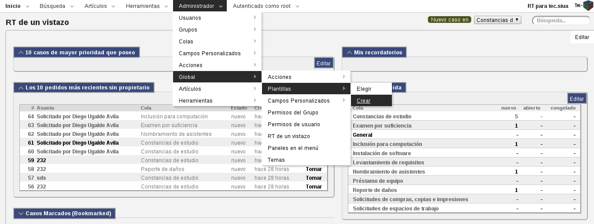

    Dentro del Contenido se puede inyectar código Perl como se aprecia en la imagen.

    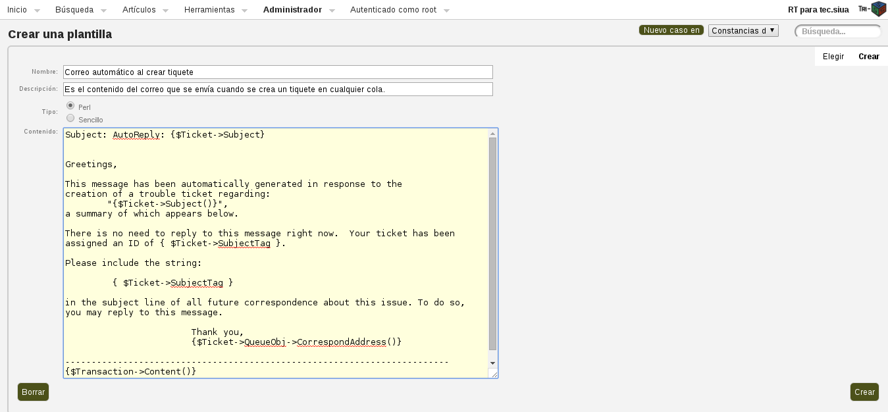

    Para ligar plantillas a un script de una cola específica, la siguiente guía puede ser útil: http://kb.mit.edu/confluence/pages/viewpage.action?pageId=33030184

4. Artículo
    
    Los artículos en RT estan organizados en clases, para crearlos primero se debe crear una clase. La clase creada se debe ligar a una de las colas existentes. También se deben crear campos personalizados para esa clase, cada campo personalizado corresponde a una de las respuestas que ofrece el artículo, para más información puede visitar: https://bestpractical.com/docs/rt/4.2/customizing/articles_introduction.html 

5. Usuario

    Al entrar a la página de creación de usuario se deben llenar los campos que aparecen en la imagen. Para poder dar permisos personalizados a un usuario, se debe marcar la casilla "Dar a este usuario permisos adicionales (Privilegiado)" y poner la contraseña root junto con la contraseña que tendrá el nuevo usuario.

    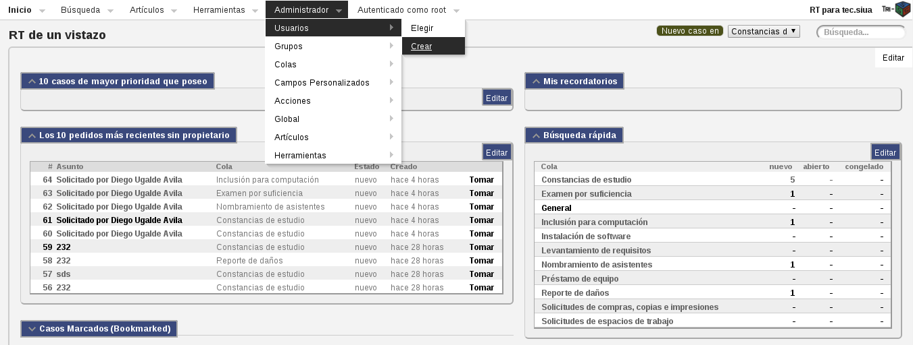 

    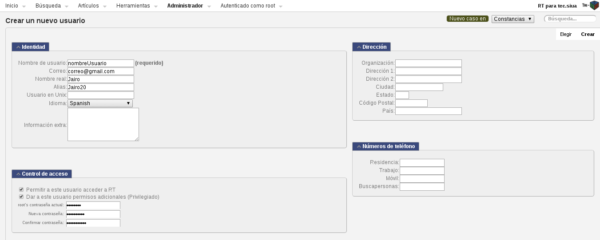 

7. Grupo

    Una buena práctica para manejar usuarios es crear grupos. De esta forma se asignan permisos al grupo y todos los usuarios los heredan. Para crear un grupo se siguen los siguientes pasos:

    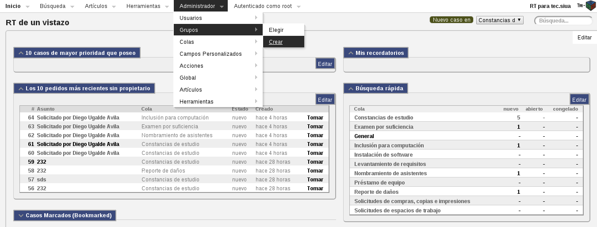

    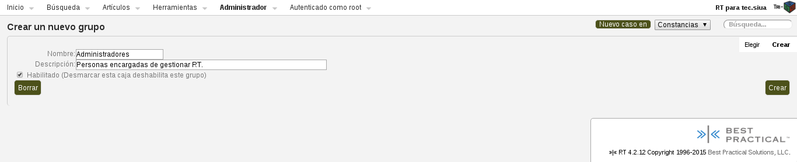

    Después de crear un grupo se deben añadir miembros al mismo, como en la siguiente secuencia de imágenes:

    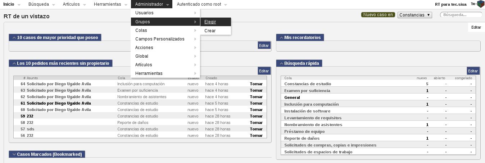 

    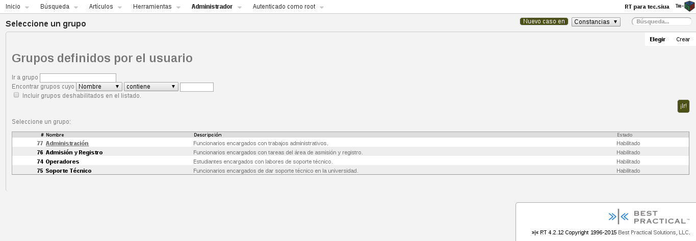 

    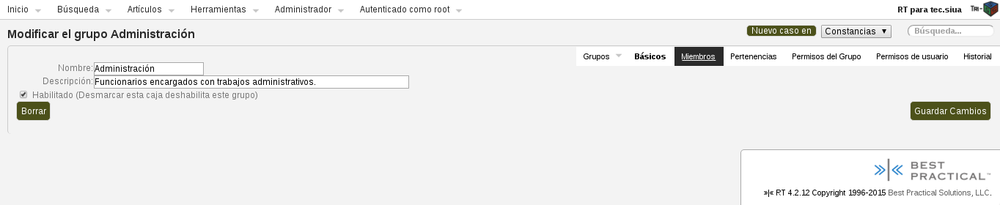 

    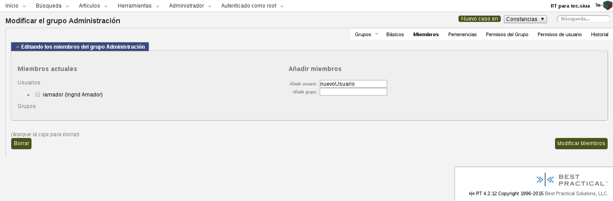 

    En cuanto a la asignación de permisos, se entra a la página para dar permisos y se marcan las casillas deseadas. Después se añade el grupo al que se le quieren dar los permisos y se actualiza.

    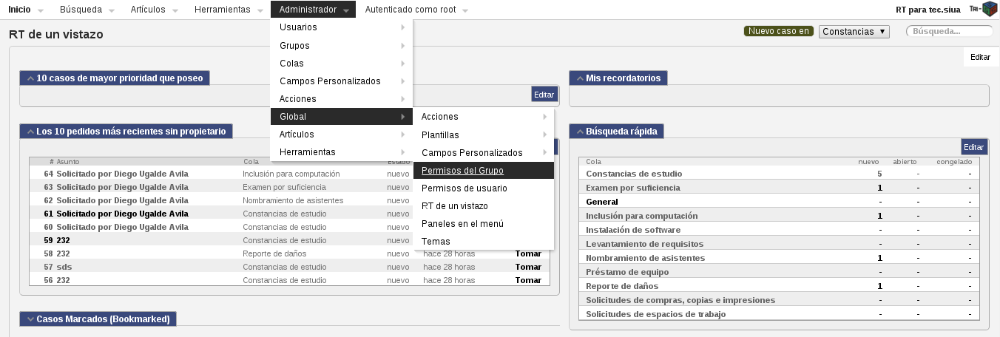 

    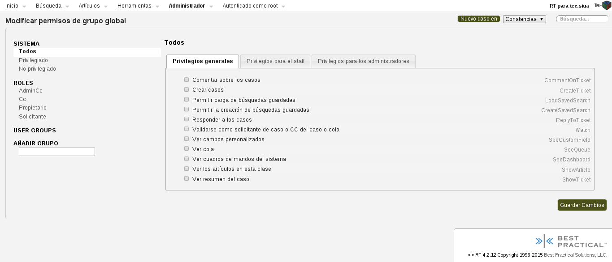 

8. Tiquete 

    En TRI-S, la creación de tiquetes se realiza principalmente por medio de las aplicaciones móvil y web, independiente de RT. Sin embargo, es posible crear tiquetes fácilmente dentro de RT, haciendo clic en el dropdown indicado en la imagen y llenando el formulario correspondiente.

    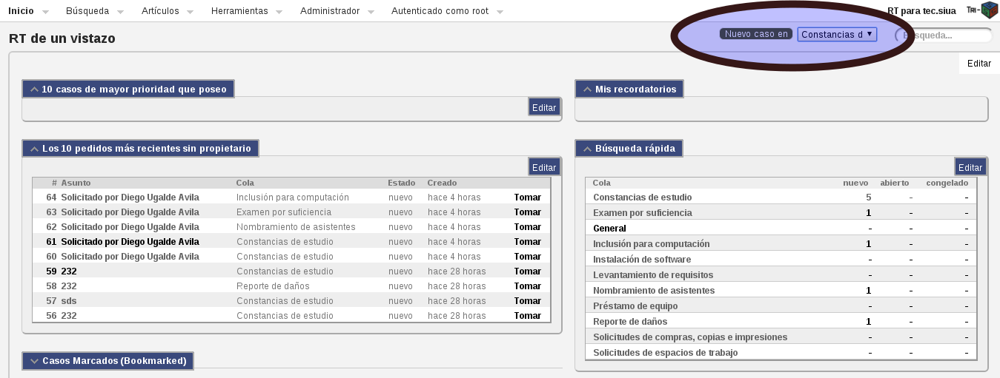 

    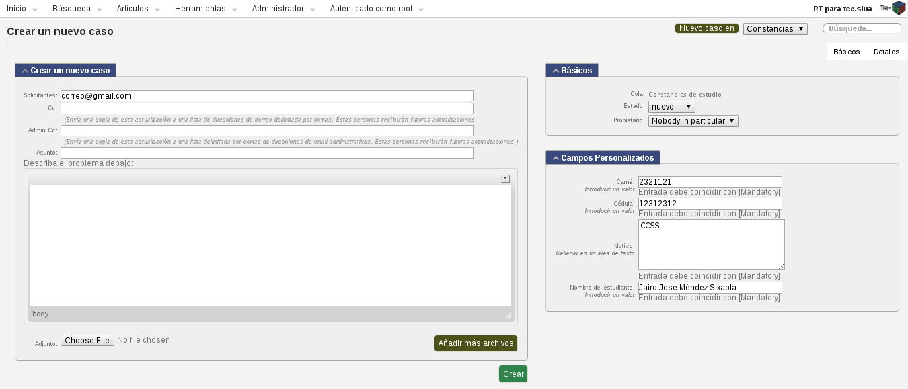 

___

#### Plantillas para respuesta automática en creación de tiquetes

Para cada cola fue configurada una plantilla para ser utilizada cuando se envía un correo de respuesta al solicitante al crear un tiquete. Se decidió que las plantillas utilizaran HTML y CSS para que fuera más personalizadas. Para modificar el texto de cada plantilla se siguen los siguientes pasos:


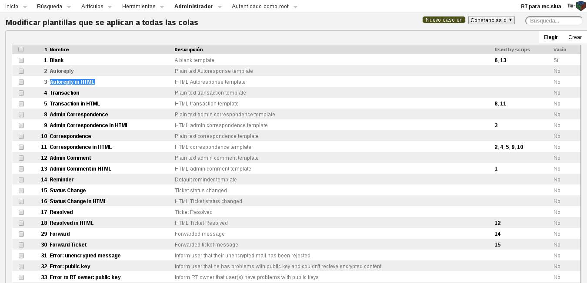


El mensaje se encuentra entre tags ```<p>```, por lo que se recomienda buscarlos en el texto. Si se complica la utilización de HTML por ser poco legible, se pueden responder correos con plantillas de texto normal.

___

#### Modificaciones en el módulo de exportar

Si se desean modificar los PDF disponibles para exportar (se encuentran en el servicio web en la ruta ```src/main/resources/pdfTemplates/```), se debe generar un archivo con el mismo nombre y los campos del formulario deben llevar los mismos nombres que los campos personalizados de Request Tracker. Para editar PDF se recomienda usar la página https://www.pdfescape.com/ .

Algunos PDFs pueden necesitar información configurable, como el caso de Constancia de estudio, que carga el nombre del coordinador actual de un archivo de configuración ubicado en el servicio web en la ruta ```src/main/resources/application-data.properties```.

El script encargado de los eventos de hacer clic en el botón de exportar dentro de RT se encuentra en el HTML añadido en la carpeta de RT ```/opt/rt4/local/html/Ticket/Display.html```. Este Javascript hace una solicitud Ajax al servicio web, por lo que la ruta debe coincidir con el dominio actual del servicio web.

___

#### Añadir más boletas para exportar

Si se desean añadir más boletas en formato PDF, se deben seguir los siguientes pasos:

1. Crear una clase en el servicio web que implemente la interfaz PDFGenerator, dentro del paquete ```cr.ac.siua.tec.utils.impl```.

2. Añadir el nuevo alias en el archivo ```src/main/resources/spring-config.xml```.

3. Agregar la plantilla del PDF en la carpeta ```src/main/resources/pdfTemplates/```.

En caso de querer añadir otros formatos, se debe implementar otro método en el controller que reciba ese tipo de solicitudes y un nuevo factory similar a PDFGeneratorFactory.

___

#### Exportar e importar base de datos MySQL

Los siguientes comandos requieren la contraseña del usuario root de MySQL.

Exportar todo el contenido de la base de datos RT: ```$ mysqldump -u root -p nombreBaseDatosRT > respaldoBaseDatos.sql```.

Importar un respaldo a RT: ```$ mysql -u root -p nombreBaseDatosRT < respaldoBaseDatos.sql```.

___

#### Agregar una solicitud nueva al sistema

Añadir una solicitud nueva a TRI-S implica los siguientes pasos:

1. Crear la cola y los campos personalizadas (en caso de que no existan) en RT.

2. Si se añadieron campos personalizados nuevos y se desean validar en el Back-End, se deben añadir en la clase FormValidator del servicio web.

3. Añadir el HTML del formulario en la carpeta forms, tanto para la aplicación móvil como para la web. Debe tener la misma estructura que los formularios existentes. Es importante que el atributo name de cada input coincida con el nombre del campo personalizado de la cola en RT. Además, el tag form debe tener de atributo request el nombre de la cola como aparece en RT.

4. Añadir el ícono de la solicitud en la carpeta de imágenes para cada aplicación (web y móvil).

5. Modificar el index.html dependiendo de la aplicación:

    * Móvil: 
    
        Se añade un elemento más dentro de la sección de tabs con el formato:
            ```html
            <li>
                <a href="#proficiency" class="form-link">
                    
                    <h2>Nombre Nueva Solicitud</h2>
                </a>
            </li>
            ```
                
        Por último se crea un nuevo ```<div>``` para la página que se va a cargar
            ```html
            <div data-role="page" id="nombreArchivoHTML" class="page-load"></div>
            ```

    * Web: 
    
        Se añade un elemento dentro del ```<ul>``` con la clase ```portfolio-items``` con el formato:
            ```html
            <li class="grid__item portfolio-item admission" linked-div="idDiv-load">
                <div class="item-inner">
                    <div class="portfolio-image img-container">
                        
                    </div>
                    <h5>Nombre nueva solicitud</h5>          
                </div>           
            </li><!--/.portfolio-item-->
            ```

        Por último se crea un nuevo ```<div>``` donde se cargará el formulario:
            ```html
            <div class="content-item-container" linked-form="nombreArchivo.html" >
                <article id="idDiv-load" class="content__item" form-name="nombreArchivoHTML"></article>
            </div>
            ```

___

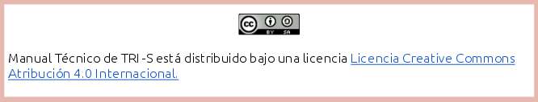